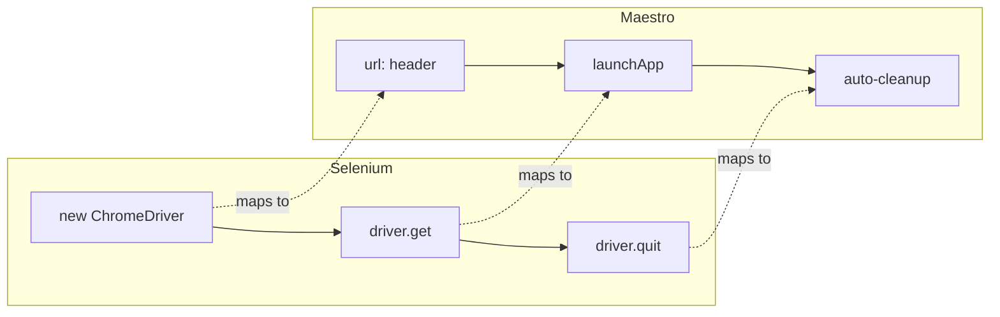

# Selenium to Maestro: A QA Engineer's Guide

> **Everything you know about Selenium, mapped to Maestro concepts**

---

## Philosophy Difference

| Selenium | Maestro |
|----------|---------|
| Imperative: "Find element, then click it" | Declarative: "Tap on this text" |
| Code-heavy (Java/Python/JS) | YAML-based configuration |
| Explicit waits required | Auto-waiting built-in |
| WebDriver protocol | Chrome DevTools Protocol (CDP) |
| Complex setup | Single binary install |

---

## Command Mapping

### Browser/App Control

```
┌────────────────────────────────────────────────────────────────┐
│                     SELENIUM                                    │
├────────────────────────────────────────────────────────────────┤
│  WebDriver driver = new ChromeDriver();                        │
│  driver.get("https://example.com");                            │
│  driver.quit();                                                 │
└────────────────────────────────────────────────────────────────┘
                              ▼
┌────────────────────────────────────────────────────────────────┐
│                      MAESTRO                                    │
├────────────────────────────────────────────────────────────────┤
│  url: https://example.com                                       │
│  ---                                                            │
│  - launchApp                                                    │
│  # Browser closes automatically after test                      │
└────────────────────────────────────────────────────────────────┘
```



| Selenium | Maestro |
|----------|---------|
| `new ChromeDriver()` | Automatic - just run `maestro test` |
| `driver.get(url)` | `url:` in header + `- launchApp` |
| `driver.navigate().refresh()` | `- launchApp` (re-launches) |
| `driver.navigate().back()` | `- back` |
| `driver.quit()` | Automatic cleanup |

---

### Finding Elements

```
┌────────────────────────────────────────────────────────────────┐
│                     SELENIUM                                    │
├────────────────────────────────────────────────────────────────┤
│  // By text                                                     │
│  driver.findElement(By.xpath("//*[text()='Login']"));          │
│                                                                 │
│  // By ID                                                       │
│  driver.findElement(By.id("submit-btn"));                      │
└────────────────────────────────────────────────────────────────┘
                              ▼
┌────────────────────────────────────────────────────────────────┐
│                      MAESTRO                                    │
├────────────────────────────────────────────────────────────────┤
│  # By text (most common)                                        │
│  - tapOn: "Login"                                               │
│                                                                 │
│  # By ID                                                        │
│  - tapOn:                                                       │
│      id: "submit-btn"                                           │
└────────────────────────────────────────────────────────────────┘
```

| Selenium Locator | Maestro Selector |
|------------------|------------------|
| `By.xpath("//*[text()='X']")` | `- tapOn: "X"` |
| `By.id("myId")` | `id: "myId"` |
| `By.name("myName")` | `id: "myName"` (name becomes resource-id) |
| `By.linkText("Click here")` | `- tapOn: "Click here"` |
| `By.partialLinkText("Click")` | `- tapOn: "Click.*"` (regex) |

---

### Click Actions

```
┌────────────────────────────────────────────────────────────────┐
│                     SELENIUM                                    │
├────────────────────────────────────────────────────────────────┤
│  // Single click                                                │
│  element.click();                                               │
│                                                                 │
│  // Double click                                                │
│  Actions actions = new Actions(driver);                         │
│  actions.doubleClick(element).perform();                        │
│                                                                 │
│  // Long press                                                  │
│  actions.clickAndHold(element)                                  │
│         .pause(Duration.ofSeconds(2))                          │
│         .release()                                              │
│         .perform();                                             │
└────────────────────────────────────────────────────────────────┘
                              ▼
┌────────────────────────────────────────────────────────────────┐
│                      MAESTRO                                    │
├────────────────────────────────────────────────────────────────┤
│  # Single tap                                                   │
│  - tapOn: "Button"                                              │
│                                                                 │
│  # Double tap                                                   │
│  - doubleTapOn: "Button"                                        │
│                                                                 │
│  # Long press                                                   │
│  - longPressOn: "Button"                                        │
└────────────────────────────────────────────────────────────────┘
```

| Selenium Action | Maestro Command |
|-----------------|-----------------|
| `element.click()` | `- tapOn: "text"` |
| `actions.doubleClick()` | `- doubleTapOn: "text"` |
| `actions.clickAndHold()` | `- longPressOn: "text"` |
| `actions.moveToElement()` | Not needed - auto-scroll |
| `element.click()` (by coords) | `- tapOn: { point: "50%,50%" }` |

---

### Text Input

```
┌────────────────────────────────────────────────────────────────┐
│                     SELENIUM                                    │
├────────────────────────────────────────────────────────────────┤
│  // Type text                                                   │
│  element.sendKeys("Hello World");                               │
│                                                                 │
│  // Clear and type                                              │
│  element.clear();                                               │
│  element.sendKeys("New Text");                                  │
│                                                                 │
│  // Press Enter                                                 │
│  element.sendKeys(Keys.ENTER);                                  │
└────────────────────────────────────────────────────────────────┘
                              ▼
┌────────────────────────────────────────────────────────────────┐
│                      MAESTRO                                    │
├────────────────────────────────────────────────────────────────┤
│  # Type text (into focused element)                             │
│  - inputText: "Hello World"                                     │
│                                                                 │
│  # Clear and type                                               │
│  - eraseText: 50                                                │
│  - inputText: "New Text"                                        │
│                                                                 │
│  # Press Enter                                                  │
│  - pressKey: Enter                                              │
└────────────────────────────────────────────────────────────────┘
```

| Selenium | Maestro |
|----------|---------|
| `element.sendKeys("text")` | `- inputText: "text"` |
| `element.clear()` | `- eraseText: 100` |
| `element.sendKeys(Keys.ENTER)` | `- pressKey: Enter` |
| `element.sendKeys(Keys.BACK_SPACE)` | `- pressKey: Backspace` |
| `element.sendKeys(Keys.TAB)` | `- pressKey: Tab` |

---

### Assertions

```
┌────────────────────────────────────────────────────────────────┐
│                     SELENIUM                                    │
├────────────────────────────────────────────────────────────────┤
│  // Assert element is displayed                                 │
│  Assert.assertTrue(element.isDisplayed());                      │
│                                                                 │
│  // Assert text equals                                          │
│  Assert.assertEquals("Expected", element.getText());            │
│                                                                 │
│  // Assert element NOT present                                  │
│  List<WebElement> elements = driver.findElements(By.id("x"));  │
│  Assert.assertTrue(elements.isEmpty());                         │
└────────────────────────────────────────────────────────────────┘
                              ▼
┌────────────────────────────────────────────────────────────────┐
│                      MAESTRO                                    │
├────────────────────────────────────────────────────────────────┤
│  # Assert element is visible                                    │
│  - assertVisible: "Expected Text"                               │
│                                                                 │
│  # Assert with ID                                               │
│  - assertVisible:                                               │
│      id: "element-id"                                           │
│                                                                 │
│  # Assert element NOT visible                                   │
│  - assertNotVisible: "Error Message"                            │
└────────────────────────────────────────────────────────────────┘
```

| Selenium | Maestro |
|----------|---------|
| `element.isDisplayed()` | `- assertVisible: "text"` |
| `!element.isDisplayed()` | `- assertNotVisible: "text"` |
| `element.isEnabled()` | `- assertVisible: { enabled: true }` |
| `element.isSelected()` | `- assertVisible: { selected: true }` |
| Custom JS assertion | `- assertTrue: "${JS_EXPRESSION}"` |

---

### Waiting

```
┌────────────────────────────────────────────────────────────────┐
│                     SELENIUM                                    │
├────────────────────────────────────────────────────────────────┤
│  // Explicit wait                                               │
│  WebDriverWait wait = new WebDriverWait(driver, 10);            │
│  wait.until(ExpectedConditions.visibilityOf(element));          │
│                                                                 │
│  // Implicit wait                                               │
│  driver.manage().timeouts().implicitlyWait(10, SECONDS);        │
│                                                                 │
│  // Thread sleep (bad practice)                                 │
│  Thread.sleep(2000);                                            │
└────────────────────────────────────────────────────────────────┘
                              ▼
┌────────────────────────────────────────────────────────────────┐
│                      MAESTRO                                    │
├────────────────────────────────────────────────────────────────┤
│  # AUTOMATIC! Maestro waits for elements by default             │
│  - tapOn: "Button"  # Auto-waits up to timeout                  │
│                                                                 │
│  # Wait for animations to complete                              │
│  - waitForAnimationToEnd:                                       │
│      timeout: 3000                                              │
│                                                                 │
│  # Extended wait for specific condition                         │
│  - extendedWaitUntil:                                           │
│      visible: "Loading Complete"                                │
│      timeout: 30000                                             │
└────────────────────────────────────────────────────────────────┘
```

**Key Insight:** In Maestro, explicit waits are rarely needed! The framework automatically waits for elements to appear.

| Selenium Wait | Maestro Equivalent |
|---------------|-------------------|
| `WebDriverWait` + `visibilityOf` | Automatic (built-in) |
| `WebDriverWait` + `elementToBeClickable` | Automatic (built-in) |
| `Thread.sleep()` | `- waitForAnimationToEnd` |
| `FluentWait` | `- extendedWaitUntil` |

---

### Scrolling

```
┌────────────────────────────────────────────────────────────────┐
│                     SELENIUM                                    │
├────────────────────────────────────────────────────────────────┤
│  // Scroll into view                                            │
│  JavascriptExecutor js = (JavascriptExecutor) driver;           │
│  js.executeScript("arguments[0].scrollIntoView()", element);   │
│                                                                 │
│  // Scroll by pixels                                            │
│  js.executeScript("window.scrollBy(0, 500)");                   │
└────────────────────────────────────────────────────────────────┘
                              ▼
┌────────────────────────────────────────────────────────────────┐
│                      MAESTRO                                    │
├────────────────────────────────────────────────────────────────┤
│  # Scroll until element is visible                              │
│  - scrollUntilVisible:                                          │
│      element: "Target Element"                                  │
│      direction: DOWN                                            │
│      timeout: 10000                                             │
│                                                                 │
│  # Simple scroll                                                │
│  - scroll                                                       │
│                                                                 │
│  # Swipe gesture                                                │
│  - swipe:                                                       │
│      direction: UP                                              │
└────────────────────────────────────────────────────────────────┘
```

---

### Screenshots

```
┌────────────────────────────────────────────────────────────────┐
│                     SELENIUM                                    │
├────────────────────────────────────────────────────────────────┤
│  File screenshot = ((TakesScreenshot) driver)                   │
│      .getScreenshotAs(OutputType.FILE);                         │
│  FileUtils.copyFile(screenshot, new File("screenshot.png"));    │
└────────────────────────────────────────────────────────────────┘
                              ▼
┌────────────────────────────────────────────────────────────────┐
│                      MAESTRO                                    │
├────────────────────────────────────────────────────────────────┤
│  - takeScreenshot: screenshot_name                              │
└────────────────────────────────────────────────────────────────┘
```

---

## Page Object Model Comparison

### Selenium POM

```java
// LoginPage.java
public class LoginPage {
    private WebDriver driver;
    
    @FindBy(id = "username")
    private WebElement usernameField;
    
    @FindBy(id = "password")
    private WebElement passwordField;
    
    @FindBy(id = "submit")
    private WebElement submitButton;
    
    public void login(String user, String pass) {
        usernameField.sendKeys(user);
        passwordField.sendKeys(pass);
        submitButton.click();
    }
}

// Test
LoginPage loginPage = new LoginPage(driver);
loginPage.login("user", "password");
```

### Maestro Subflows (Similar Pattern)

```yaml
# subflows/login.yaml
---
- tapOn: "Enter your User ID"
- inputText: "${USER_ID}"
- tapOn: "Enter your password"  
- inputText: "${PASSWORD}"
- tapOn: "Login"
- waitForAnimationToEnd:
    timeout: 2000
```

```yaml
# test.yaml
url: http://localhost:4446
env:
  USER_ID: testuser
  PASSWORD: secret123
---
- launchApp
- runFlow: subflows/login.yaml
- assertVisible: "Dashboard"
```

---

## Complete Example: Side-by-Side

### Selenium (Java) - ~40 lines

```java
public class LoginTest {
    private WebDriver driver;
    
    @Before
    public void setup() {
        ChromeOptions options = new ChromeOptions();
        driver = new ChromeDriver(options);
        driver.manage().timeouts().implicitlyWait(10, TimeUnit.SECONDS);
    }
    
    @Test
    public void testLogin() {
        driver.get("http://localhost:4446");
        
        WebDriverWait wait = new WebDriverWait(driver, 10);
        wait.until(ExpectedConditions.visibilityOfElementLocated(
            By.xpath("//*[text()='Login To Application']")));
        
        driver.findElement(By.xpath("//*[text()='Enter your User ID']")).click();
        driver.findElement(By.tagName("input")).sendKeys("testuser");
        
        driver.findElement(By.xpath("//*[text()='Enter your password']")).click();
        driver.findElements(By.tagName("input")).get(1).sendKeys("password123");
        
        driver.findElement(By.id("submit_button")).click();
        
        wait.until(ExpectedConditions.visibilityOfElementLocated(
            By.xpath("//*[text()='Dashboard']")));
        
        Assert.assertTrue(driver.findElement(
            By.xpath("//*[text()='Dashboard']")).isDisplayed());
    }
    
    @After
    public void teardown() {
        driver.quit();
    }
}
```

### Maestro (YAML) - ~15 lines

```yaml
# login_test.yaml
url: http://localhost:4446
---
- launchApp
- assertVisible: "Login To Application"

- tapOn: "Enter your User ID"
- inputText: "testuser"

- tapOn: "Enter your password"
- inputText: "password123"

- tapOn:
    id: submit_button

- waitForAnimationToEnd:
    timeout: 2000

- assertVisible: "Dashboard"
```

---

## Key Takeaways for Selenium Users

| What You're Used To | What Maestro Does Differently |
|---------------------|-------------------------------|
| Writing code | Writing YAML |
| Managing WebDriver lifecycle | Automatic lifecycle |
| Adding explicit waits | Built-in smart waiting |
| Complex element locators | Simple text matching |
| POM classes | Subflow files |
| Try-catch for stale elements | Automatic retry |
| Screenshots require code | One-liner command |

---

## Migration Tips

1. **Start Simple**: Begin with text-based selectors, add IDs only when needed
2. **Trust Auto-Wait**: Remove all `sleep()` and explicit waits initially
3. **Use Subflows**: Replace Page Objects with reusable YAML flows
4. **Embrace YAML**: Less code = less maintenance
5. **Check Hierarchy**: Use `maestro hierarchy` when element not found

---

**Previous:** [← Getting Started](./01-GETTING_STARTED.md) | **Next:** [Flutter Web Setup →](./03-FLUTTER_WEB_SETUP.md)
