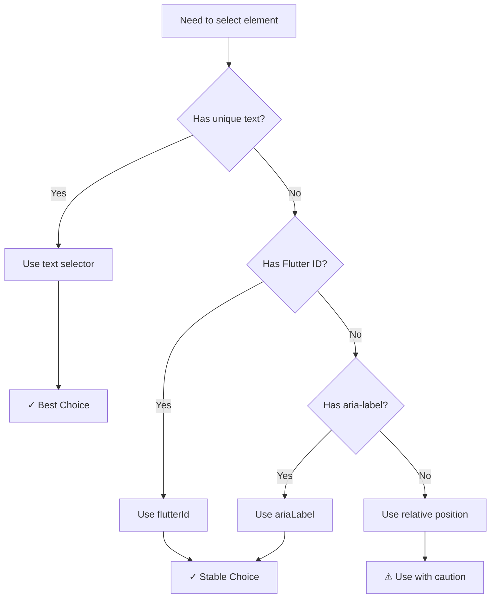

# Element Selection Guide

> **How to find and target elements in Flutter Web applications**

---

## Element Selection Strategy

```
┌─────────────────────────────────────────────────────────────────┐
│                  ELEMENT SELECTION PRIORITY                      │
├─────────────────────────────────────────────────────────────────┤
│                                                                  │
│   1. TEXT        →  Most readable, use when text is unique      │
│        ↓                                                         │
│   2. FLUTTER ID  →  Use for interactive elements                 │
│        ↓                                                         │
│   3. ARIA-LABEL  →  Use for accessibility-labeled elements       │
│        ↓                                                         │
│   4. POSITION    →  Last resort, use relative selectors         │
│                                                                  │
└─────────────────────────────────────────────────────────────────┘
```



---

## Text-Based Selection

The simplest and most readable approach.

### Exact Text Match

```yaml
- tapOn: "Login"
- tapOn: "Submit Order"
- assertVisible: "Welcome, John"
```

### Regex Pattern

```yaml
# Match pattern
- tapOn: "Order #[0-9]+"
- assertVisible: "Total: \\$[0-9]+\\.[0-9]{2}"

# Match any of multiple texts
- tapOn: "(Login|Sign In)"

# Partial match with wildcards
- tapOn: ".*Continue.*"
```

### Case Sensitivity

Text matching is **case-sensitive** by default:

```yaml
# These are different:
- tapOn: "Login"      # Matches "Login"
- tapOn: "login"      # Matches "login"
- tapOn: "[Ll]ogin"   # Matches both (regex)
```

---

## ID-Based Selection

### Standard ID (resource-id)

Maps from multiple HTML attributes:
- `id`
- `aria-label`
- `name`
- `title`
- `data-testid`

```yaml
- tapOn:
    id: "submit-button"

- assertVisible:
    id: "error-message"
```

### Custom Flutter ID (selectorAliases)

First, configure in `config.yaml`:

```yaml
platform:
  web:
    selectorAliases:
      flt-semantics-identifier: flutterId
      aria-label: ariaLabel
```

Then use in tests:

```yaml
# Using flutterId
- tapOn:
    flutterId: submit_button

- tapOn:
    flutterId: user_email_input

# Using ariaLabel
- assertVisible:
    ariaLabel: "Navigation menu"
```

### Adding Flutter IDs in Code

```dart
// In your Flutter widget
Semantics(
  identifier: 'submit_button',   // → flt-semantics-identifier
  label: 'Submit the form',      // → aria-label
  child: ElevatedButton(
    onPressed: _onSubmit,
    child: Text('Submit'),
  ),
)
```

---

## Relative Position Selectors

Find elements relative to other elements.

### Below

```yaml
# Find "Edit" button below "User Profile" heading
- tapOn:
    text: "Edit"
    below: "User Profile"

# With nested selector
- tapOn:
    text: "Delete"
    below:
      id: "item-123"
```

### Above

```yaml
# Find label above input field
- assertVisible:
    text: "Email"
    above: "Enter your email"
```

### Left Of / Right Of

```yaml
# Cancel button to the left of Submit
- tapOn:
    text: "Cancel"
    leftOf: "Submit"

# Next button to the right of Previous
- tapOn:
    text: "Next"
    rightOf: "Previous"
```

### Child Of

```yaml
# Button inside a specific container
- tapOn:
    text: "Add"
    childOf:
      id: "shopping-cart"
```

### Contains Child

```yaml
# Container that has a specific child
- tapOn:
    containsChild:
      text: "Featured"
```

### Contains Descendants

```yaml
# Element containing multiple descendants
- tapOn:
    containsDescendants:
      - text: "Title"
      - text: "Price"
```

---

## Index-Based Selection

When multiple elements match, select by index.

```yaml
# First matching element (0-based)
- tapOn:
    text: "Item"
    index: 0

# Second matching element
- tapOn:
    text: "Item"
    index: 1

# Last matching element (negative index)
- tapOn:
    text: "Item"
    index: -1

# Second to last
- tapOn:
    text: "Item"
    index: -2
```

---

## State-Based Selection

Select elements based on their state.

### Enabled/Disabled

```yaml
# Only enabled buttons
- tapOn:
    text: "Submit"
    enabled: true

# Disabled elements
- assertVisible:
    text: "Submit"
    enabled: false
```

### Selected

```yaml
# Selected tab
- assertVisible:
    text: "Home"
    selected: true
```

### Checked

```yaml
# Checked checkbox
- assertVisible:
    text: "Remember me"
    checked: true

# Unchecked
- tapOn:
    text: "Accept terms"
    checked: false
```

### Focused

```yaml
# Currently focused input
- assertVisible:
    id: "email-input"
    focused: true
```

---

## Combined Selectors

Combine multiple criteria for precise selection.

```yaml
# Text AND below another element
- tapOn:
    text: "Save"
    below: "Form Title"
    enabled: true

# ID AND state
- tapOn:
    flutterId: submit_button
    enabled: true

# Text AND index
- tapOn:
    text: "Edit"
    index: 0
    below: "My Items"
```

---

## Optional Selectors

Don't fail the test if element isn't found.

```yaml
# Optional tap (won't fail)
- tapOn:
    text: "Dismiss"
    optional: true

# Optional assert
- assertVisible:
    text: "Promo Banner"
    optional: true
```

---

## Debugging Element Selection

### View Hierarchy

See all elements Maestro can detect:

```bash
maestro hierarchy
```

Output shows:
```
├── text: "Welcome"
│   bounds: [0,0][100,50]
│   resource-id: "welcome_text"
│   flt-semantics-identifier: "welcome_header"
├── text: "Login"
│   bounds: [200,300][300,350]
│   resource-id: "login_button"
...
```

### Common Issues

| Problem | Solution |
|---------|----------|
| "Element not found" | Use `maestro hierarchy` to see exact text |
| Multiple matches | Add `index`, or use more specific selector |
| Text changes dynamically | Use regex pattern or ID |
| Custom ID not working | Check `selectorAliases` in config.yaml |

---

## Best Practices

### DO ✅

```yaml
# Use readable text when possible
- tapOn: "Login"

# Use stable IDs for critical elements
- tapOn:
    flutterId: checkout_button

# Add IDs in Flutter code for testability
# Semantics(identifier: 'checkout_button', ...)
```

### DON'T ❌

```yaml
# Avoid positional coordinates
- tapOn:
    point: "234,567"

# Avoid index-only selection
- tapOn:
    index: 3    # What element is this?
```

### Selector Priority Recommendation

```
1. Text              →  Human-readable, self-documenting
2. flutterId/ID      →  Stable, developer-controlled
3. ariaLabel         →  Accessibility-friendly
4. Relative position →  When above options fail
5. Index             →  Last resort, add comments
6. Coordinates       →  Avoid if possible
```

---

## Real-World Examples

### Login Form

```yaml
# Good: Using text and Flutter IDs
- tapOn: "Enter your User ID"
- inputText: "${USERNAME}"

- tapOn: "Enter your password"
- inputText: "${PASSWORD}"

- tapOn:
    flutterId: submit_button
```

### Navigation Menu

```yaml
# Open sidebar
- tapOn: "Menu button for navigation"

# Navigate to section
- tapOn: "Settings"

# Select sub-item below Settings
- tapOn:
    text: "Account"
    below: "Settings"
```

### Table/List Selection

```yaml
# Select specific row by content
- tapOn:
    text: "Edit"
    below: "John Doe"

# Or by index
- tapOn:
    text: "Edit"
    index: 2    # Third edit button
```

### Modal/Dialog

```yaml
# Wait for modal
- assertVisible: "Confirm Action"

# Click button in modal
- tapOn:
    text: "Confirm"
    below: "Confirm Action"
```

---

**Previous:** [← Commands Reference](./04-COMMANDS_REFERENCE.md) | **Next:** [Advanced Features →](./06-ADVANCED_FEATURES.md)
