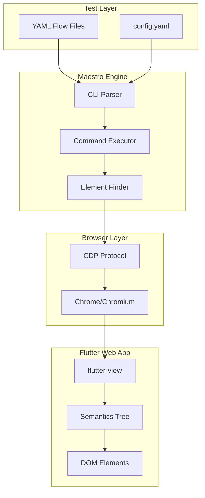

# Maestro for Flutter Web Testing

> **The Complete Guide for QA Engineers**

[](https://maestro.dev)
[](https://flutter.dev)
[](../../LICENSE)

**Version:** 2.0+ | **Last Updated:** January 2026 | **Audience:** QA Engineers

---

## What is Maestro?

**Maestro** is an open-source UI testing framework that makes end-to-end testing simple and fast. Unlike Selenium's verbose code, Maestro uses human-readable YAML flows that are easy to write, read, and maintain.

```yaml
# Your first Flutter Web test - it's this simple!
url: https://your-flutter-app.com
---
- launchApp
- tapOn: "Login"
- inputText: "user@example.com"
- tapOn: "Submit"
- assertVisible: "Welcome"
```

---

## Why Maestro for Flutter Web?

| Challenge with Selenium | Maestro Solution |
|------------------------|------------------|
| Complex WebDriver setup | Single CLI install |
| Explicit waits everywhere | Built-in auto-waiting |
| Flaky element locators | Smart element matching |
| Verbose Java/Python code | Simple YAML syntax |
| Flutter shadow DOM issues | Native Flutter support |
| Custom scroll handling | Built-in scroll commands |

---

## Quick Navigation

### Getting Started
| Document | Description | Time |
|----------|-------------|------|
| [01 - Getting Started](./01-GETTING_STARTED.md) | Install Maestro and run your first test | 5 min |
| [02 - Selenium to Maestro](./02-SELENIUM_TO_MAESTRO.md) | Concept mapping for Selenium users | 10 min |
| [03 - Flutter Web Setup](./03-FLUTTER_WEB_SETUP.md) | Configure Maestro for Flutter Web | 5 min |

### Reference
| Document | Description |
|----------|-------------|
| [04 - Commands Reference](./04-COMMANDS_REFERENCE.md) | Complete command documentation |
| [05 - Element Selection](./05-ELEMENT_SELECTION.md) | Selectors, custom identifiers |
| [06 - Advanced Features](./06-ADVANCED_FEATURES.md) | Loops, conditions, JavaScript, hooks |

### Best Practices
| Document | Description |
|----------|-------------|
| [07 - Best Practices](./07-BEST_PRACTICES.md) | Patterns, conventions, tips |
| [08 - Troubleshooting](./08-TROUBLESHOOTING.md) | Common issues and solutions |

### Examples
| File | Description |
|------|-------------|
| [login_flow.yaml](./examples/login_flow.yaml) | Complete login test |
| [navigation_test.yaml](./examples/navigation_test.yaml) | Sidebar/menu navigation |
| [form_submission.yaml](./examples/form_submission.yaml) | Form with validation |

---

## Architecture Overview

```
┌─────────────────────────────────────────────────────────────────┐
│                        MAESTRO CLI                               │
│  ┌──────────────┐  ┌──────────────┐  ┌──────────────┐           │
│  │  YAML Flow   │  │   Maestro    │  │   Chrome     │           │
│  │   Parser     │──│   Engine     │──│   WebDriver  │           │
│  └──────────────┘  └──────────────┘  └──────────────┘           │
└─────────────────────────────────────────────────────────────────┘
                              │
                              ▼
┌─────────────────────────────────────────────────────────────────┐
│                      FLUTTER WEB APP                             │
│  ┌──────────────┐  ┌──────────────┐  ┌──────────────┐           │
│  │ flutter-view │  │  Semantics   │  │    DOM       │           │
│  │   element    │──│    Tree      │──│   Elements   │           │
│  └──────────────┘  └──────────────┘  └──────────────┘           │
└─────────────────────────────────────────────────────────────────┘
```



---

## Key Concepts

### 1. Flows
A **Flow** is a YAML file that defines a user journey (login, checkout, search, etc.)

### 2. Commands
**Commands** are actions like `tapOn`, `inputText`, `assertVisible`

### 3. Selectors
**Selectors** identify elements by text, ID, or custom attributes

### 4. Config
**config.yaml** defines workspace settings like custom identifiers

---

## 5-Minute Quick Start

```bash
# 1. Install Maestro
curl -fsSL "https://get.maestro.mobile.dev" | bash

# 2. Create a test file
cat > my_first_test.yaml << 'EOF'
url: https://your-flutter-app.com
---
- launchApp
- assertVisible: "Welcome"
EOF

# 3. Run the test
maestro test my_first_test.yaml
```

---

## Project Structure

```
your-project/
├── maestro/
│   ├── config.yaml              # Workspace configuration
│   ├── flows/
│   │   ├── login.yaml           # Login flow
│   │   ├── dashboard.yaml       # Dashboard tests
│   │   └── checkout.yaml        # Checkout flow
│   └── subflows/
│       ├── common_login.yaml    # Reusable login steps
│       └── common_logout.yaml   # Reusable logout steps
└── test_results/                # Test output (screenshots, reports)
```

---

## Feature Highlights

### Custom Identifiers for Flutter
Map Flutter semantics attributes to friendly names:

```yaml
# config.yaml
platform:
  web:
    selectorAliases:
      flt-semantics-identifier: flutterId
      aria-label: ariaLabel
```

### Use in Tests
```yaml
- tapOn:
    flutterId: submit_button
```

### Built-in Resilience
- **Auto-waiting**: No need for `sleep()` or explicit waits
- **Smart retries**: Automatic retry on transient failures
- **Flakiness tolerance**: Handles dynamic UI changes

---

## Resources

- **Official Documentation**: [docs.maestro.dev](https://docs.maestro.dev/)
- **GitHub Repository**: [github.com/mobile-dev-inc/maestro](https://github.com/mobile-dev-inc/maestro)
- **Community Slack**: [Join the workspace](https://maestrodev.typeform.com/to/FelIEe8A)

---

## License

This documentation is part of the Maestro project, licensed under [Apache 2.0](../../LICENSE).

---

**Next:** [Getting Started →](./01-GETTING_STARTED.md)
